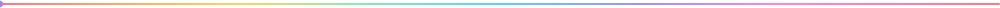

<div align="center">



<br/>

**A portfolio that boots.**

RayanOS is a full desktop environment for the browser — boot sequence, lock screen, draggable windows,
a working taskbar, a start menu, quick settings, widgets and sixteen applications — built around
real work instead of a scroll page.

<br/>

[](https://react.dev)
[](https://www.typescriptlang.org)
[](https://vite.dev)
[](https://zustand.docs.pmnd.rs)
[](https://tailwindcss.com)
[](https://motion.dev)

[](./LICENSE)
[](./CONTRIBUTING.md)
[](#)

</div>




Most developer portfolios are one long page with a hero, a grid and a footer. They are pleasant and
completely forgettable. RayanOS takes the opposite approach: it treats the portfolio as a product worth
using, then hides nothing behind the theatre.

Everything a visitor actually needs — biography, eight case studies, writing, photo gallery, resume and
a working contact form — is delivered through application windows inside a desktop that behaves like a
real machine. Windows stack, drag, resize, maximise, minimise and close. The taskbar groups them by
application. Right-clicking the desktop opens a genuine context menu. The clock ticks. Brightness is a
real filter. Your theme, accent colour, wallpaper and notes survive a reload.

<div align="center">

| What it looks like                  | What it actually is                                       |
| :---------------------------------- | :-------------------------------------------------------- |
| A "PouyaOS"-style desktop shell     | React 19 + TypeScript on Vite 6                           |
| Acrylic, mica and glass surfaces    | Hand-written CSS custom properties + Tailwind             |
| Windows that spring open and settle | Framer Motion springs, no canned keyframes                |
| A boot screen and lock screen       | A real state machine (`boot → lock → desktop → shutdown`) |
| A start menu with tiles and search  | A single app registry driving every surface               |
| A terminal with twenty-six commands | Genuine command parser with tab completion and history    |
| Ambient music that plays            | Live Web Audio synthesis — **zero audio files**           |
| A wallpaper picker                  | Four generated originals, switchable from three places    |

> **The short version:** this is not a mockup of an operating system. It is one, small enough to read
> in an afternoon, and honest about what it does not do.


<table>
<tr><td width="50%" valign="top">

### 🖥️ Shell & window manager

- **Boot sequence** — firmware check, mounting, shell start, typed logo reveal
- **Lock screen** — live clock, weather chip, shake-on-error passcode
- **Sleep & shutdown** — with a real power dialog (sleep, restart, shut down)
- **Draggable windows** — pointer-captured drag with edge clamping
- **Eight-way resize** — every edge and corner, with sensible minimums
- **Z-order focus** — click any window to bring it forward
- **Maximise & restore** — remembers the pre-maximise rectangle per window
- **Minimise animation** — collapses toward the taskbar rather than vanishing

</td><td width="50%" valign="top">

### 🧭 Shell surfaces

- **Start menu** — pinned tile grid, all-apps list, six recommended files
- **Search** — fuzzy scoring across apps, pages, projects, posts and photos
- **Task view** — mission-control grid of every open window with live dimensions
- **Widgets board** — weather, agenda, photo grid, wallpaper picker, availability
- **Quick settings** — six toggles, brightness and volume sliders, notifications
- **System tray** — wifi, volume, battery (which actually charges), clock
- **Notification toasts** — stack, auto-dismiss, click to open the source app
- **Context menu** — desktop right-click with submenus and a clipboard-note Easter egg

</td></tr>
<tr><td width="50%" valign="top">

### 🧩 Sixteen applications

Bio browser with tabbed in-app routing · Workbench with filters, grid/list views and
eight full case studies · File Explorer with a real folder tree · Photos with a keyboard
lightbox · Resume with four tabs · Terminal · Settings · Sound Lab · Notepad · Sticky note ·
Store with simulated installs · Memory Wall · Wormhole · Calculator with a tape · Contact · Welcome tour.

</td><td width="50%" valign="top">

### 🎨 Personalisation

- **Light and dark** — a proper token swap, not a filter
- **Six accent colours** — driven by a single CSS variable
- **Four wallpapers** — changeable from Settings, the context menu or the widgets board
- **Brightness** — a real screen filter from 35% to 100%
- **Night light** — genuine sepia/hue screen treatment
- **Focus mode** — dims the shell to a radial vignette
- **Everything persists** — Zustand `persist` middleware into `localStorage`

</td></tr>
</table>


<div align="center">

| Layer         | Choice                          | Why                                                                              |
| :------------ | :------------------------------ | :------------------------------------------------------------------------------- |
| **Framework** | React 19                        | Concurrent rendering; the shell re-renders constantly and must stay smooth       |
| **Language**  | TypeScript 5.7 (strict)         | Window rectangles, payloads and app ids are all typed end to end                 |
| **Build**     | Vite 6                          | Instant HMR while authoring the shell, small production bundles                  |
| **State**     | Zustand 5 + `persist`           | One store for the whole OS; no provider pyramid, no context churn                |
| **Styling**   | Tailwind 3.4 + hand-written CSS | Utilities for layout, custom properties for the acrylic surfaces                 |
| **Motion**    | Framer Motion 12                | Spring physics for windows; `AnimatePresence` for mount/unmount                  |
| **Icons**     | lucide-react                    | Plus custom SVG for app tiles, the logo and the guide character                  |
| **Audio**     | Web Audio API                   | Sound Lab synthesises everything live — there is not one `.mp3`                  |
| **Routing**   | Internal route stack            | The browser app keeps history, back/forward and deep links, no router dependency |

</div>

**Zero runtime dependencies beyond this list. No analytics. No tracking. No external font or CDN
requests — the whole thing works offline after first load.**




```
rayan-os-portfolio/
├── .github/
│   └── workflows/
│       └── deploy.yml            # optional: auto-deploy to GitHub Pages
├── assets/
│   └── readme/                   # animated SVG headers used by this README
├── public/                       # everything served as-is
│   ├── icons/                    # favicon.svg, apple-touch-icon, 192/512 PWA icons
│   ├── images/
│   │   ├── gallery/              # 7 photos
│   │   ├── profile/              # portrait used on the resume and lock screen
│   │   ├── projects/             # 8 project visuals
│   │   └── wallpapers/           # 4 wallpapers, switchable at runtime
│   ├── favicon.ico
│   ├── favicon-32.png
│   └── site.webmanifest
├── src/
│   ├── components/
│   │   ├── apps/                 # 16 application windows, one file each
│   │   │   ├── AppView.tsx       # the app router
│   │   │   ├── BrowserApp.tsx
│   │   │   ├── WorkbenchApp.tsx
│   │   │   ├── ExplorerApp.tsx
│   │   │   ├── GalleryApp.tsx
│   │   │   ├── ResumeApp.tsx
│   │   │   ├── TerminalApp.tsx
│   │   │   ├── SettingsApp.tsx
│   │   │   ├── StudioApp.tsx
│   │   │   ├── NotesApp.tsx
│   │   │   ├── StoreApp.tsx
│   │   │   ├── WallApp.tsx
│   │   │   ├── SnakeApp.tsx
│   │   │   ├── ContactApp.tsx
│   │   │   ├── CalculatorApp.tsx
│   │   │   ├── StickyApp.tsx
│   │   │   └── WelcomeApp.tsx
│   │   ├── os/                   # the shell itself
│   │   │   ├── WindowFrame.tsx   # drag, resize, controls, mount animation
│   │   │   ├── Taskbar.tsx       # pinned apps, running apps, system tray
│   │   │   ├── StartMenu.tsx     # tiles, all apps, recommended, power
│   │   │   ├── Flyouts.tsx       # search, quick settings, task view, widgets, toasts
│   │   │   ├── DesktopIcons.tsx  # shortcuts with selection and keyboard launch
│   │   │   ├── DesktopMenu.tsx   # right-click context menu
│   │   │   ├── Splash.tsx        # boot, lock, sleep and shutdown screens
│   │   │   └── Guide.tsx         # the floating companion character
│   │   └── ui/
│   │       └── Img.tsx           # image with a graceful missing-file state
│   ├── data/                     # ⭐ ALL CONTENT LIVES HERE
│   │   ├── profile.ts            # name, bio, experience, skills, FAQ, testimonials
│   │   ├── projects.ts           # eight case studies + gallery manifest
│   │   ├── blog.ts               # five essays
│   │   └── apps.ts               # the application registry
│   ├── hooks/
│   │   └── useShell.ts           # useDrag, useResize, useInterval, useClickOutside
│   ├── lib/
│   │   ├── icons.tsx             # AppIcon tile renderer, glyph map, colour helpers
│   │   └── search.ts             # fuzzy search index
│   ├── store/
│   │   └── os.ts                 # the entire OS state machine
│   ├── App.tsx                   # shell composition and global shortcuts
│   ├── index.css                 # design tokens, shell primitives, keyframes
│   ├── main.tsx
│   └── vite-env.d.ts
├── .editorconfig
├── .gitignore
├── index.html                    # metadata, Open Graph, JSON-LD
├── LICENSE
├── package.json
├── postcss.config.js
├── PUBLISH-GUIDE.md              # drag-and-drop GitHub publishing walkthrough
├── README.md                     # you are here
├── tailwind.config.js
├── tsconfig.json
├── tsconfig.app.json
├── tsconfig.node.json
└── vite.config.ts
```

**Where to start reading:** `src/store/os.ts` is the machine. `src/components/os/WindowFrame.tsx`
is where it becomes visible. `src/data/` is the only thing you need to touch to make it yours.


### Requirements

- **Node.js 18 or newer** (20 LTS recommended) — [download](https://nodejs.org)
- **npm** (comes with Node) — or pnpm / yarn / bun, the scripts are standard
- Any modern browser: Chrome, Edge, Firefox, Safari

### Run it locally

```bash
# 1. get the code
git clone https://github.com/YOUR-USERNAME/rayan-os-portfolio.git
cd rayan-os-portfolio

# 2. install dependencies (about 140 packages, ~20 seconds)
npm install

# 3. start the dev server
npm run dev
```

The terminal prints a local URL, normally **http://localhost:5173**. Open it and you will land on the
boot screen. Edit any file under `src/` and the browser updates instantly.

### Build for production

```bash
npm run build     # type-checks, then writes a static site to dist/
npm run preview   # serve dist/ locally at http://localhost:4173
```

`dist/` is a plain folder of HTML, CSS, JS and images. Upload it anywhere — GitHub Pages, Netlify,
Vercel, Cloudflare Pages, or a USB stick. No server, no database, no build step at runtime.

### Other commands

| Command           | What it does                                                |
| :---------------- | :---------------------------------------------------------- |
| `npm run dev`     | Dev server with hot module replacement                      |
| `npm run build`   | Type-check with `tsc`, then bundle with Vite into `dist/`   |
| `npm run preview` | Serve the built site locally to check the production output |
| `npm run lint`    | Type-check only, nothing written to disk                    |


The shell is fully keyboard-drivable. That is the point of building it as a desktop.

<div align="center">

| Shortcut                                   | Action                                  |
| :----------------------------------------- | :-------------------------------------- |
| <kbd>Ctrl</kbd> + <kbd>K</kbd>             | Open search from anywhere               |
| <kbd>F1</kbd>                              | Open the Welcome tour                   |
| <kbd>Alt</kbd> + <kbd>1</kbd>…<kbd>5</kbd> | Launch the first five pinned apps       |
| <kbd>Esc</kbd>                             | Close any flyout, menu or panel         |
| <kbd>Enter</kbd>                           | Launch the selected desktop icon        |
| <kbd>↑</kbd> <kbd>↓</kbd>                  | Move through search results             |
| <kbd>Tab</kbd>                             | Complete terminal commands              |
| <kbd>Ctrl</kbd> + <kbd>L</kbd>             | Clear the terminal                      |
| <kbd>Ctrl</kbd> + <kbd>S</kbd>             | Save the scratchpad in Notepad          |
| <kbd>Space</kbd>                           | Pause or resume Wormhole                |
| <kbd>R</kbd>                               | Restart Wormhole                        |
| <kbd>←</kbd> <kbd>→</kbd>                  | Previous and next photo in the lightbox |

</div>




<div align="center">

| App                  | What is in it                                   | Highlights                                                                            |
| :------------------- | :---------------------------------------------- | :------------------------------------------------------------------------------------ |
| **Welcome**          | Three-step guided tour                          | Featured project cards, build specs, quick-launch chips                               |
| **Meridian Browser** | Biography, work, gallery, writing, contact, FAQ | Six tabs, back/forward history, bookmark toggle, `rayan.os` address bar               |
| **Workbench**        | Eight case studies                              | Category filters, sorting, grid/list toggle, shareable per-project links              |
| **File Explorer**    | `D:/Projects`, `Documents`, `Media`, `System`   | Live breadcrumb, folder search, list/grid views, working folder navigation            |
| **Photos**           | Seven original photographs                      | Masonry and grid layouts, place filter, keyboard lightbox, favourites, download       |
| **Resume**           | Experience, skills, references                  | Four tabs, career timeline, testimonial cards, print-to-PDF button                    |
| **Terminal**         | Twenty-six commands                             | Tab completion, history recall, real actions (`open`, `theme`, `accent`, `wallpaper`) |
| **Settings**         | Appearance, System, Notifications, About        | Theme previews, accent swatches, wallpaper grid, storage chart, factory reset         |
| **Sound Lab**        | Generative ambient synthesizer                  | Four live-synthesised voices, three presets, real-time mixer visualiser               |
| **Notepad**          | Persistent scratch notes                        | Create, pin, search and delete notes; word count; `Ctrl+S` to save                    |
| **Store**            | Simulated app store                             | Install progress animations that are honest about being theatre                       |
| **Memory Wall**      | Public corkboard                                | Post a note, like others' notes, stored locally and instantly visible                 |
| **Wormhole**         | Grid game                                       | Wrapping walls, speed ramps with score, best-score persistence                        |
| **Calculator**       | Standard calculator                             | Full keyboard support, memory keys, running tape of past calculations                 |
| **Sticky note**      | One small note                                  | Four paper colours, autosaves on every keystroke                                      |
| **Contact**          | Working contact form                            | Topic chips, budget field, prefilled `mailto:`, copy-to-clipboard details             |

</div>


This repository is a template. You never need to touch a component to make it your own — the content
layer is four files.

### 1. Your identity — `src/data/profile.ts`

```ts
export const profile = {
  name: "Your Name",
  role: "Your Role",
  roleSecondary: "Second Role",
  tagline: "One line that sounds like a person wrote it.",
  location: "Your City, Country",
  email: "you@example.com",
  summary:
    "The paragraph that appears on the lock screen, welcome tour and about page.",
  longBio: ["Paragraph one.", "Paragraph two.", "Paragraph three."],
  // stats, values, socials, experience, skillGroups, education,
  // certifications, testimonials, timeline and faq all live here too
} as const;
```

### 2. Your work — `src/data/projects.ts`

Each entry powers both a gallery card and a full case study page. Replace the `image` filename with
your own file dropped into `public/images/projects/`.

```ts
{
  id: 'my-project',
  name: 'My Project',
  kind: 'Product',              // drives the filter chips
  year: '2026',
  role: 'What you did',
  tagline: 'The one-liner under the title.',
  problem: 'What was broken before you arrived.',
  approach: ['Step one.', 'Step two.', 'Step three.'],
  outcome: ['A measured result.', 'Another measured result.'],
  stack: ['React', 'TypeScript'],
  image: 'my-project-screenshot.jpg',
  accent: '#5c83ff',            // badge colour
  size: 'normal',
  featured: true,               // shows on the welcome tour
}
```

### 3. Your writing — `src/data/blog.ts`

Five essay-shaped objects. Delete the file's contents and add your own; the Writing tab builds itself.

### 4. Your apps — `src/data/apps.ts`

The registry every surface reads from. Changing `pinned: true` moves an app into the start menu tiles
and the taskbar; `desktop: true` puts an icon on the wallpaper.

### Replacing the pictures

Drop files into the matching folder using the same filenames, and nothing else needs to change:

| Folder                      | Files                                                   | Used by                                    |
| :-------------------------- | :------------------------------------------------------ | :----------------------------------------- |
| `public/images/wallpapers/` | `ridge.jpg`, `aurora.jpg`, `terrace.jpg`, `paper.jpg`   | Desktop, lock screen, Settings, widgets    |
| `public/images/profile/`    | `rayan-malik-portrait.jpg`                              | Resume header, About page, browser sidebar |
| `public/images/projects/`   | 8 files matching `src/data/projects.ts`                 | Workbench, browser, welcome tour           |
| `public/images/gallery/`    | 7 files matching `src/data/projects.ts` `gallery` array | Photos, widgets board, browser             |

**Complete asset manifest** — every filename the code expects, so you can see at a glance what to
provide:

<details>
<summary><b>Wallpapers</b> — <code>public/images/wallpapers/</code> (4 files)</summary>

```
ridge.jpg      Blue Ridge        default wallpaper
aurora.jpg     Aurora Drift
terrace.jpg    Monsoon Terrace
paper.jpg      Paper Bloom
```

</details>

<details>
<summary><b>Profile</b> — <code>public/images/profile/</code> (1 file)</summary>

```
rayan-malik-portrait.jpg    used by the resume header, about page and browser sidebar
```

</details>

<details>
<summary><b>Project visuals</b> — <code>public/images/projects/</code> (8 files)</summary>

```
cadence-design-system.jpg          Cadence          design system
trellis-preview-engine.jpg         Trellis          developer tooling
palette-token-pipeline.jpg         Palette          tooling
ledgerly-multicurrency-ledger.jpg  Ledgerly         product
rickshaw-transit-routing.jpg       Rickshaw         civic tech
quiet-hours-focus-timer.jpg        Quiet Hours      small software
atlas-type-specimen-tool.jpg       Atlas Type       editor tooling
loom-notes-video-review.jpg        Loom Notes       product
```

</details>

<details>
<summary><b>Gallery</b> — <code>public/images/gallery/</code> (7 files)</summary>

```
portrait-studio-lahore.jpg                    portrait orientation
workshop-desk-setup.jpg
wireframe-wall-exploration.jpg
conference-talk-interface-decisions.jpg       portrait orientation
typography-specimen-study.jpg
lahore-rooftop-evening.jpg
hardware-prototype-bench.jpg
```

</details>

Recommended sizes: wallpapers **1920×1080**, project visuals **1280×800**, gallery photos
**1200×800** (or **800×1200** for the two portraits), profile portrait **1024×1536**. Keep each file
under about 400 KB so the first paint stays quick.

If a file is missing, the `Img` component renders a labelled placeholder tile naming the exact file
you need to add — so a partially-filled template still looks intentional rather than broken. Try it:
delete any image and reload, and you will see the placeholder with its filename.

### Changing the look

All design tokens are CSS custom properties in `src/index.css`. Change them once and the whole shell
follows:

```css
:root {
  --os-accent: #5c83ff; /* every highlight, focus ring and selected state */
  --os-window-bg: rgba(28, 30, 35, 0.74);
  --os-glass-blur: blur(30px) saturate(185%);
  --os-radius: 10px;
  --os-shadow-lg: 0 34px 90px -22px rgba(0, 0, 0, 0.86);
}
```

Accent colours offered in Settings are defined once in `src/store/os.ts`:

```ts
export const ACCENTS = [
  { id: "iris", label: "Iris", hex: "#5c83ff" },
  // add your own — the Settings page picks it up automatically
];
```

### Adding a new application

Three steps, about ten minutes:

1. Create `src/components/apps/MyApp.tsx` exporting a component that fills its window.
2. Register it in `src/components/apps/AppView.tsx` under a new `case`.
3. Add an entry to `src/data/apps.ts` with a unique `id`, a lucide glyph name from
   `src/lib/icons.tsx`, and a colour.

It now appears in search, the start menu, the store, the task view and the desktop context menu.


### Fastest route: publish with drag and drop (no terminal at all)

For the complete walkthrough — repository name, description, topics, which folders to drag and how to
batch more than 100 files — see **[PUBLISH-GUIDE.md](./PUBLISH-GUIDE.md)**. The short version:

1. Build the site locally: `npm run build`
2. Create an empty repository on GitHub named `rayan-os-portfolio`
3. **Drag the _contents_ of `dist/`** into the repository's upload page
4. Settings → Pages → Source: `Deploy from a branch` → `main` → `/ (root)`
5. Your site is live at `https://Muhammad112233-creator.github.io/Portfolio-Template-17/`

### Better route: automatic builds on every push

This repository already ships `.github/workflows/deploy.yml`. Push the **source** (not `dist/`) and
every future commit rebuilds and republishes itself:

1. Push the project to GitHub
2. **Settings → Pages → Build and deployment → Source: GitHub Actions**
3. Push anything to `main` — the workflow builds and deploys

> **Important:** the two routes are different repo layouts. Drag-and-drop publishing means your
> repository _is_ the built site. The Actions workflow means your repository _is_ the source. Pick one.
> The drag-and-drop route is described in detail in the publishing guide precisely because it confuses
> people the first time.

### Other hosts

| Host                 | Build command   | Publish directory                     |
| :------------------- | :-------------- | :------------------------------------ |
| **Netlify**          | `npm run build` | `dist`                                |
| **Vercel**           | `npm run build` | `dist`                                |
| **Cloudflare Pages** | `npm run build` | `dist`                                |
| **GitHub Pages**     | `npm run build` | `dist` (or use the included workflow) |

The Vite config uses `base: './'`, so relative asset paths work from a subdirectory, a custom domain or
a file:// path without changes.


<table>
<tr><td width="50%" valign="top">

### Accessibility

- Every window is a labelled `role="dialog"` with an accessible name
- Window controls are real buttons with `title` and `aria-label`
- Start menu, quick settings and search are `role="dialog"` with keyboard support
- The taskbar is a `role="toolbar"`; switches use `role="switch"` with `aria-checked`
- Visible `:focus-visible` outline on every interactive element
- `prefers-reduced-motion` collapses every animation to near-zero duration
- Body text stays selectable; only chrome is `user-select: none`
- Live regions announce guide messages and notifications
- A `<noscript>` fallback gives the name, role and a contact link

</td><td width="50%" valign="top">

### Performance

- **~135 kB gzipped JavaScript** for the entire shell and all sixteen apps
- **~9 kB gzipped CSS**
- Manual chunking keeps React, Framer Motion and app code in separate cacheable files
- Zero external network requests: no fonts, no CDN, no analytics
- App icons are drawn with CSS gradients and inline SVG, not bitmaps
- Images use `loading="lazy"` below the fold
- Windows use `contain: layout paint` to limit repaint scope during drag
- Audio is synthesised on demand and every node is released on stop

</td></tr>
</table>

### Browser support

Chrome and Edge 111+, Firefox 113+, Safari 16.4+. The shell relies on `backdrop-filter`,
CSS custom properties, `color-mix()` and pointer events — all baseline-available in those versions.


- [ ] Snapping windows to halves and quarters by dragging to an edge
- [ ] A music player that reads real audio files instead of synthesising
- [ ] Multi-desktop workspaces with a swipe gesture in task view
- [ ] An optional build flag that swaps the shell for a plain scroll version for slow connections
- [ ] Command palette for shell actions, separate from app search
- [ ] Configurable boot time, skippable per-visitor

Have an idea? Open an issue — this is meant to be forked, not admired.


**Built by [Rayan Malik](https://github.com/)** — product engineer and interface designer, Lahore, Pakistan.

**Design language:** informed by Fluent, the acrylic and mica material used across modern desktop
operating systems. The implementation here is original: every token, surface, transition and component
was authored for this project. No proprietary assets, fonts, icons or code were copied.

**Assets:** all wallpapers, project visuals and the portrait are original generated artwork, free to
replace with your own. App icons are inline SVG and CSS gradients drawn at runtime.

**Typeface:** the stack falls back to the system UI font — `Segoe UI Variable` on Windows,
`SF Pro` on Apple platforms, `Inter` if installed. Nothing is downloaded.

**License:** [MIT](./LICENSE). Use it, fork it, sell what you build with it. A link back is
appreciated and never required.

<div align="center">
<br/>

### If this helped you land something, tell me.

<a href="https://github.com/"></a>
<a href="https://www.linkedin.com/"></a>
<a href="mailto:hello@example.com"></a>

<br/>
<sub>Built carefully, in Lahore. No template, no page builder, no AI slop in the copy.</sub>

<br/><br/>


</div>

<div align="center">

## 🌟 Support the Project

If you find this template useful, please consider giving it a star! It helps others discover the repository and supports future development.

</div>
